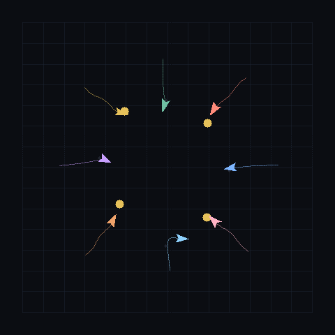

# MaleCNS Simulation

A minimal, inspectable 2D foraging loop. It takes a directed weighted neuron graph, applies bounded continuous activity updates, maps sensory inputs and motor outputs, and records every tick. **This is an exploratory controller, not a biological reconstruction.** The included `demo.json` is synthetic. **`circuits/dng13.json` contains a verified MaleCNS v1.0 subgraph: 11 neurons and 32 connections.** With the default decoder it turns away from the pellet. Reversing the turn sign is an interface choice that produces collection; it is not evidence that this pathway encodes food. See [the first experiment](docs/DNG13_EXPERIMENT.md) and [the decoder report](docs/DNG13_DECODER.md).

## Project plan

See [PLAN.md](PLAN.md) for current status, [ROADMAP.md](ROADMAP.md) for the artificial-life sequence, and [docs/NEXT_PHASES.md](docs/NEXT_PHASES.md) for the remaining work. Each completed implementation step is committed separately. Contributor instructions are in [AGENTS.md](AGENTS.md).

## Run now (Python 3.9+, standard library)

```bash
python3 sim.py run demo.json --ticks 120 --out trace.json
```

The output records position, heading, food location, motor activity, and collection events. A fixed seed makes runs repeatable.

## Watch a 10-fly survival contest

Ten independent copies of the same circuit share a larger map and three pellets that do not respawn. Energy drains every tick; a meal can keep a fly alive to the end. Spawn pose is the only difference between flies. This is a scored toy contest, not biological competition.

```bash
python3 sim.py contest circuits/dng13.json --ticks 800 --turn-sign -1 --turn-gain 1 --out view.html --open
```

Default: 10 flies, 3 pellets, map ±20. The command prints a leaderboard and writes `view.html`. Click a fly in the sidebar to highlight its trail.

## Watch ecosystem v0.1

A persistent world: food respawns at a **new random location** after each meal, agents age, and eating extends artificial lifespan. Nearby adults reproduce; offspring inherit and mutate speed, lifespan, fertility, metabolism, and decoder gains, plus a few nearly useless quirks. MaleCNS topology stays fixed.

```bash
python3 sim.py ecosystem circuits/dng13.json --ticks 12000 --turn-sign -1 --turn-gain 1 --out view.html --open
```

Useful knobs: `--agents`, `--food-rate`, `--aging-rate`, `--repro-rate`, `--mutation-rate`, `--mutation-sigma`, `--max-population`, `--record-every`. Default runs are long enough for many generations; frames are stored every 6 ticks so the HTML stays usable. The inspector follows a living descendant when the selected agent dies. Lineage bars and contested-meal counts are on the dashboard.

## Try it in the browser

The GitHub Pages app runs the same ecosystem live. Choose a rule preset or set agent count, food spawn rate, aging rate, reproduction rate, and mutation rate, then randomize.

[Open the live ecosystem](https://ikaankeskin.github.io/malecns-simulation/)



Serve `docs/` locally if you want the same page without GitHub:

```bash
python3 -m http.server 8000 --directory docs
```

Then open http://127.0.0.1:8000/ . The published site needs GitHub Pages enabled (Actions source). 

## Watch a run

The viewer is a self-contained HTML file. It replays every tick: arena, heading, food, trail, collection events, motor output, and per-neuron activity. Pause, step, reset, and a tick slider are included. The page labels the circuit as synthetic or MaleCNS-derived.

```bash
python3 sim.py view demo.json --ticks 120 --out view.html
python3 sim.py view circuits/dng13.json --ticks 500 --turn-sign -1 --turn-gain 1 --out view.html
```

Open `view.html` in a browser. Add `--open` to launch it. Generated viewers are local outputs and are not committed. Default `sim.py run` traces stay JSON.

## Run the real-data circuit now

No bulk download or third-party Python package is required to run the included extract:

```bash
python3 sim.py run circuits/dng13.json --ticks 500 --out trace.json
python3 sim.py run circuits/dng13.json --ticks 500 --turn-sign -1 --turn-gain 1 --out trace.json
python3 experiments.py circuits/dng13.json --out experiment.json
```

The first command uses the original avoidance decoder. The second uses the selected attraction decoder from the mapping experiment. `experiments.py` sweeps turn/sensory signs and turn gains on development seeds, then compares the selected mapping with disconnected, input-silenced, and shuffled-source controls on held-out seeds. Raw traces are local outputs. Checked-in reports: `docs/dng13-experiment.json`, `docs/dng13-decoder-experiment.json`.

Transmitter signs are a separate controller comparison. They are not inferred from the wiring. Acetylcholine at confidence 0.5 or higher stays positive. GABA at that confidence would turn the outgoing weight negative. Glutamate edges are dropped. Monoamines are recorded and not applied. Unclear or lower-confidence neurons stay positive. The live page keeps the all-positive controller.

```bash
python3 neurotransmitter_experiment.py circuits/dng13.json --ticks 500 --out neurotransmitter-comparison.json
```

On held-out seeds 10–19, the all-positive controller collected a mean of 4.0 items, the same per-seed counts as the decoder report. Dropping the two outgoing edges of the one glutamate neuron (LT51, body 11670) collected 4.1. Every other neuron in the extract is acetylcholine above 0.9, so the sign shuffle matches the signed controller. Both signed runs still move the motors when the sensory input is on, and stay still when it is off. That is an interface result, not evidence that DNg13 encodes food or inhibition. Full rows: `docs/neurotransmitter-comparison.json`. The eleven source rows are in `circuits/dng13-neurotransmitters.json`.

## Extract a real MaleCNS circuit

The new importer streams the official Arrow connection table in batches. It selects the left/right DNg13 descending neurons and up to eight direct visual-projection inputs per output, with at least five synapses. It then retains **every** connection within the selected neurons, including weaker and recurrent connections. Neuron IDs, annotations, and raw synapse counts are preserved.

```bash
python3 -m venv .venv
source .venv/bin/activate
python3 -m pip install -r requirements-data.txt
python3 malecns_data.py download
python3 malecns_data.py extract
python3 sim.py run circuits/dng13.json --ticks 120 --out trace.json
```

Downloads total approximately 1.07 GB. Extraction verifies pinned SHA-256 hashes before writing a real-data-labelled circuit. Existing downloads are reused; an incomplete or different release fails verification. No API token is needed. Run from the repository directory. Simulation alone requires no third-party dependencies.

[configs/dng13.json](configs/dng13.json) contains the selection rule and its scientific rationale. Provenance in each extracted graph includes source URLs, byte sizes, SHA-256 hashes, release, license, attribution, chosen inputs, and modelling assumptions. The hashes were measured from official public downloads; they are not publisher-signed checksums. Bulk data stays outside git.

DNg13 is shown in [Janelia's visual-to-movement example](https://male-cns.janelia.org/media/). This direct-input subgraph omits retinal and upstream processing. Simulator `sensory` and `motor` roles are interface assignments; the biological output class remains `descending_neuron`. Soma-side-to-world-side mapping is a hypothesis.

The current controller is a toy continuous-activity model. The default weights stay positive: no spikes, physiological calibration, or plasticity. A separate held-out comparison can apply aggregate transmitter signs without changing the live ecosystem. Wiring plus a tuned decoder can collect synthetic food in this world; that does not establish biological food-seeking. The original CSV importer remains available for exploratory user-supplied graphs; it does not verify official provenance.

## Validation

### Remembering help received

Enable **energy gifts** and **prefer past helpers**, then **Apply** in the live app. Mint trails show donor → recipient; the selected agent's helper panel shows received-energy memory. Python: `python3 sim.py ecosystem circuits/dng13.json --gifts --reciprocity --turn-sign -1 --turn-gain 1 --out view.html`.

Each agent retains up to eight givers. Received energy evidence is capped at 4, halves every 400 ticks and expires after 1,200 ticks. Recipient ranking is distance divided by `1 + 2 × min(1, remembered energy)` when reciprocity is on; nearest-first is preserved when off. Only help from earlier ticks influences the choice. Memories are individual and not inherited. Gift cost, attempt chance, generosity and action learning retain their existing rules. Both gifts and reciprocity default off.

Run `python3 reciprocity_experiment.py circuits/dng13.json --out reciprocity-comparison.json` for five paired seeds with gifts on, hazards/predation/action learning off. At 2,000 ticks, preference off/on means were: births 7/7, plant meals 27.6/27.6, final alive 0/0, gifts to past helpers 5.4/6.0. This small exploratory sample shows no survival improvement. Counts of returned help do not establish friendship or causation. Full rules and rows: [comparison](docs/reciprocity-comparison.json). Earlier reports describe earlier engine versions and should not be treated as current paired controls.

```bash
python3 -m unittest discover -s tests -v
```

Extraction tests use synthetic Arrow fixtures, test deterministic selection and retained weights, and reject missing bilateral outputs, malformed schemas, negative connections, and unverified source hashes. They require the packages in `requirements-data.txt`. Controller tests additionally check deterministic runs, stimulus responsiveness, malformed graphs, weight scaling, movement ablations, decoder validation, a synthetic decoder-sweep split, and HTML viewer playback payloads. These tests do not establish biological fidelity.

## Data attribution

MaleCNS is produced by FlyEM (HHMI Janelia), the University of Cambridge Department of Zoology, the MRC Laboratory of Molecular Biology, and Google Research. Official data is distributed under CC BY; retain the specific release license and citation with derived extracts. The derived circuit is adapted from this data: selected nodes and induced connections, plus experimental interface roles. Its original IDs and integer synapse counts are retained; the derived data remains under CC BY 4.0. Source: https://male-cns.janelia.org/download/.


### Seasonal ecology

The ecosystem now cycles through Bloom (1.65× plant lifecycle speed), Abundance (1×), Drought (0.3×), and Recovery (0.8×), each lasting 400 ticks by default. Hungry agents can sense and consume fresh corpses. Each body yields one freshness-scaled energy meal; unlike plants, it grants no lifespan bonus. Uneaten bodies decay after 180 ticks and can advance one nearby seed or growing patch by 12 timer units. These engineered rules are not claims about fly biology. The MaleCNS-derived circuit topology remains fixed.

Use `--season-length 200` to accelerate seasons, `--no-seasons` for stable growth, and `--no-scavenging` to disable corpse feeding with the `ecosystem` command. Bodies can still compost when scavenging is disabled.

```bash
python3 ecology_experiment.py circuits/dng13.json --seeds 0,1,2,3,4 --ticks 2000 --sense-range 12 --out ecology-comparison.json
```

Initial five-seed means (Python; 2,000 ticks; range 12), in order seasons/scavenging: on/on alive 1.0, births 10.2, plant meals 31.4, scavenged 12.4, living founders 0.2; on/off alive 0, births 8.2, plant meals 32.2, scavenged 0, living founders 0; off/on alive 0.6, births 10.8, plant meals 31.2, scavenged 13.8, living founders 0.4; off/off alive 0, births 8.2, plant meals 28.8, scavenged 0, living founders 0. These exploratory results do not establish that seasons or scavenging improve survival. Full settings and per-seed rows: `docs/ecology-comparison.json`.

Three hazard discs are placed from the seed, inside the map, without changing where food spawns. Standing in one costs 0.02 energy per tick. If the edge is closer than food, the agent is given a direction away from the disc; the circuit still only steers. A death inside a disc is labelled hazard, ahead of starvation and old age. Use `--no-hazards` to turn this off.

```bash
python3 hazard_experiment.py circuits/dng13.json --seeds 0,1,2,3,4 --ticks 2000 --sense-range 12 --out hazard-comparison.json
```

Initial five-seed means (Python; 2,000 ticks; range 12): hazards off/on alive 1.0/0, births 10.2/3.2, plant meals 31.4/17.4, hazard-labelled deaths 0/0. These exploratory results do not show that the discs caused the deaths in this sample. Full rows: `docs/hazard-comparison.json`.

Energy gifts are off unless `--gifts` is set or the live **energy gifts** box is checked and applied. A donor pays 0.15 energy and a neighbour within 4 units keeps 0.10. The comparison below holds hazards off.

```bash
python3 gift_experiment.py circuits/dng13.json --seeds 0,1,2,3,4 --ticks 2000 --sense-range 12 --out gift-comparison.json
```

Initial five-seed means: gifts off/on alive 1.0/0.8, births 10.2/11.6, plant meals 31.4/38.2, gifts sent 0/30.2, energy paid 0/4.53, energy kept 0/3.02. A recipient still alive 100 ticks later is not evidence the gift saved them. Full rows: `docs/gift-comparison.json`.

Predation is off unless `--predation` is set or the live **predation** box is checked and applied. An agent with energy above 0.5 may spend 0.08 to deal 0.45 damage to a neighbour within 2 units, only when that neighbour is closer than the nearest mature plant. A killing blow is labelled predation. The attacker is not given the meal.

```bash
python3 predation_experiment.py circuits/dng13.json --seeds 0,1,2,3,4 --ticks 2000 --sense-range 12 --out predation-comparison.json
```

Initial five-seed means, with hazards, seasons, scavenging, and learning left on and gifts left off: predation off/on alive 0/0, births 3.2/1.8, scavenged meals 4.4/3.2, predation deaths 0/1.4, starvation 0.8/2.2, old age 10.4/6.2. Exploratory. Full rows: `docs/predation-comparison.json`.

Caution, generosity, and aggression are inherited scales. One is neutral: it leaves the hazard comparison and the gift and attack chances unchanged. Caution multiplies how far a hazard edge can be and still beat a meal. Generosity and aggression multiply the attempt chances, which stay capped at 1. The genes are tendencies, not character traits.

```bash
python3 personality_experiment.py circuits/dng13.json --seeds 0,1,2,3,4 --ticks 2000 --sense-range 12 --out personality-comparison.json
```

The comparison turns hazards, gifts, and predation on, then lets one gene mutate while the other two stay at 1. Five-seed means for the all-frozen world: alive 0, births 1.4, gifts 4.2, attacks 5.2, hazard entries 1. Letting caution vary: births 1.8, gifts 5.6, attacks 5.6, entries 1.4. Generosity: births 2.8, gifts 6.8, attacks 6.8, entries 1.6. Aggression: births 2.6, gifts 6.4, attacks 6.8, entries 1.6. Gene means stayed within about 0.98 to 1.01. Few offspring were born, so this sample does not show a tendency spreading. Exploratory. Full rows: `docs/personality-comparison.json`.

Each agent can also keep a gift score and an attack score. They use the same decay and cap as sender scores, and twice the score scales the inherited generosity or aggression. The scores are not inherited and do not change synapses. Turn them off with `--no-lifetime-learning`.

A living donor compares their own energy 100 ticks after a gift with the energy they had just after paying. Eating a corpse from one's own kill counts as a useful attack; reaching that spot after the corpse is gone counts as empty. A corpse the attacker never reaches does not change the score.

```bash
python3 lifetime_experiment.py circuits/dng13.json --seeds 0,1,2,3,4 --ticks 2000 --sense-range 12 --out lifetime-comparison.json
```

Personality genes stay at 1. Hazards, gifts, and predation stay on. Five-seed means, learning off/on: alive 0/0, births 1.4/1.4, gifts 4.2/4.4, attacks 5.2/5.2, hazard entries 1/1. Gift outcomes were 1.2 useful and 2.4 empty when learning was on. Attack outcomes were 0.4 and 0.4. The off cell matches the frozen-personality run. Exploratory. Full rows: `docs/lifetime-comparison.json`.

Maps now reflect agents at their boundaries. Python and browser runs are deterministic within each engine; their random generators differ, so equal seeds do not imply identical trajectories across engines.

The live dashboard exposes seasonal growth, corpse scavenging, hazard discs, and ticks per season. **Apply** restarts with the selected rules and the same seed; **Step** pauses and advances one tick. The arena tint and banner track the season, rose rings show corpse freshness, and expanding rose/green rings mark scavenging/fertilization. Select an agent to see its current target intent, dashed target line, and a family list of ancestors and descendants. The list is capped at four generations and shows a count of further relatives. These intent labels describe the engineered sensory target selection, not inferred cognition. Python HTML replays include season, recycling totals, and the same family list.

### Food signals and location memory

Agents can report the nearest mature food they currently sense. Reports reach neighbours within 18 units, cost 0.01 energy, and are attempted at most every 60 ticks. Visible signals last 24 ticks; accepted location memories last 180 ticks. Each agent keeps at most four locations and six recent outcomes. Locations remain stale if food is consumed or moves; agents find out on arrival or forget them on expiry. Reports are received once at emission, not continuously relayed.

Two inherited multipliers, `signalling` and `responsiveness`, control deterministic probabilities of reporting and remembering. Memory goals compete with directly sensed food by distance, with remembered goals winning exact ties for consistent outcome tracking. Following a remembered location supplies a fixed 0.5 sensory stimulus scaled by sensory gain; it does not move the agent directly or change circuit topology. This engineered policy is a baseline, not learned cooperation. No energy reward is awarded for signalling.

Use `--no-communication` for a baseline and `--sense-range 12` to try limited local perception. Signal-associated meals do not establish a causal benefit: the food may have become directly visible anyway. Run multiple seeds with communication on/off before drawing survival conclusions.

The live inspector now shows remembered locations, their expiry, recent outcomes, and inherited signalling/response tendencies. Violet rings mark broadcasts; violet target lines mark remembered goals. **Food communication** and **sensory range** take effect with **Apply**, which restarts the same seed.

Run the reproducible CPU comparison:

```bash
python3 social_experiment.py circuits/dng13.json --seeds 0,1,2,3,4 --ticks 2000 --sense-range 12 --out social-comparison.json
```

Initial five-seed means (Python; 2,000 ticks; range 12): communication off/on yielded 0/0.6 living agents, 9.4/9.6 births, and 39.6/33.8 plant meals. These mixed exploratory results do not establish a general survival benefit. The toggle changes signalling, memory, and remembered-target steering together; this is not an isolated test of information alone. See `docs/social-comparison.json` for settings, circuit hash and individual runs. The communication comparison explicitly disables sender learning to preserve that baseline.

### Learning which senders are useful

**Learn sender reliability** is enabled by default; change it and press **Apply** to restart the same seed. The selected agent's **Sender usefulness** panel shows scores, decayed evidence and effective report-acceptance chances. Python playback includes sender scores too. Use `--no-social-learning` to retain fixed inherited responsiveness while keeping communication enabled.

Actual arrival outcomes train a small per-sender estimate: a plant meal is positive evidence, an empty arrival is negative evidence, and an expired trip is ignored. The score is `(1 + useful) / (2 + useful + empty)`, with a neutral 0.5 prior. Evidence halves every 400 ticks and is capped at 16 per sender. At most eight sender records are retained; the oldest outcome is evicted first, with source ID breaking ties. The score multiplies inherited responsiveness by `2 × score` (capped at 1) when deciding whether to remember a new report. Old targets and MaleCNS locomotion are unchanged. Offspring inherit tendencies, not learned records.

This is **learned perceived usefulness**, not honesty, friendship, language, or neural plasticity. Another agent may have eaten an honestly reported patch before the receiver arrives. The model deliberately has no access to hidden ground truth when assigning feedback.

```bash
python3 social_experiment.py circuits/dng13.json --learning --seeds 0,1,2,3,4 --ticks 2000 --sense-range 12 --out reliability-comparison.json
```

This comparison holds communication on and toggles only sender learning. Initial learning off/on means: final alive 0.6/1.0, births 9.6/10.2, plant meals 33.8/31.4. Five seeds are exploratory, not a general benefit claim. Full settings and per-seed results: `docs/reliability-comparison.json`. LLM cognition and cooperation actions remain future work.
