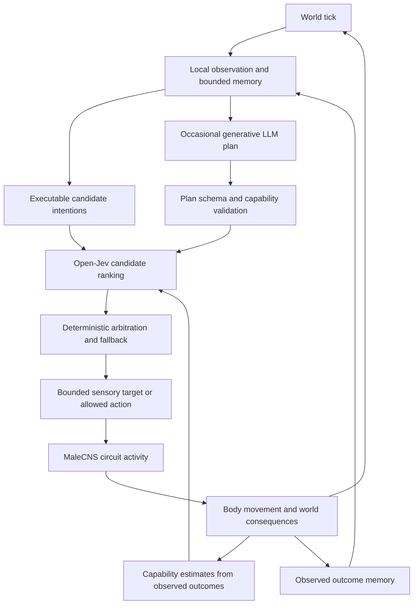

# MaleCNS cognition plan: Open-Jev, language planning and biological circuit structure

Status: proposed research and development plan, 2026-10-03. This document authorizes no claim of improved behavior or biological fidelity. Implementation follows separate validated commits. The user selected [Open-Jev](https://zefan-cai.github.io/open-jev/) as the decision-model project.

## 1. Recommended direction

Build an organism that can choose a goal, attempt it through its own neural controller, notice failure, and revise its strategy. Use three timescales:

- **MaleCNS controller, every simulation tick:** transform engineered sensory inputs into movement through a documented biological graph.
- **Open-Jev, at bounded decision points:** rank a small set of executable intentions using local observations, memory, current goals and measured execution capabilities.
- **Generative LLM, occasionally:** propose a short plan, consolidate experience and revise a failed strategy. Plans use the same fixed action vocabulary as every other policy.

The flagship question is: **Can a planner that learns the capabilities of its own connectome-derived controller adapt to sensory ambiguity and circuit damage better than a planner that assumes actions always work?** A second, more MaleCNS-specific question asks whether anatomically annotated routing motifs contribute beyond matched synthetic topology.

Start with individual autonomous agents. The riverkeeper remains the player's role; an agent does not acquire reservoir-building, valve or remote-watering powers through a prompt. A later riverkeeper adviser is a separate product experiment with a different observation/action contract.

This plan extends the existing research roadmap and supersedes the historical exclusion of LLM cognition in `NEXT_PHASES.md`. It retains a non-LLM baseline throughout.

## 2. What exists and what is missing

Current foundation: 11 neurons and 32 connections from the verified DNg13 extract; continuous bounded activity; a tuned sensory/motor decoder; independent organism state; renewable food, gardens, soil/water, memories, signalling and learned outcome scores. The existing 114 passing tests establish software behavior. They do not demonstrate general intelligence or biological reproduction of behavior.

`ecosystem.py:motors_for` currently selects a sensory target through `social.select_target` and hazard competition, then calls `Circuit.step` and movement integration. Gifts, attacks and planting have separate automatic rules. There is no general policy interface, true simulation checkpoint, or external-decision event log. Browser saves reconstruct player actions and do not yet capture model decisions. Equal seeds across Python and JavaScript do not yield identical trajectories.

The current extract is too small and too selectively sampled to represent the full MaleCNS, higher-level decision circuits, or sex-specific behavior. Its measured wiring and assumed dynamics must remain separately identified.

## 3. Architecture and ownership



**Observation contract.** Each observation contains tick, self energy/age/pose, currently sensed resources/hazards/agents, received messages, remembered locations with observation time and source, and recent action outcomes. Global resources, hidden future rain, unreceived messages and other agents' private memories are excluded. If soil sensing is added, document it as a new simulation sensor and give every comparison policy the same access. A visible empty location and a location outside sensory range are distinct.

**Initial candidates.** Choose among up to eight targets: pursue visible food, revisit a remembered resource, follow a received report, move away from an observed hazard, continue the current intention, or choose an exploratory bearing. Candidates carry stable IDs, expiry and preconditions. Exploration requires an explicit bounded virtual stimulus; it is a new controller interface assumption and must be ablated. Do not equate zero drive with instant stopping: recurrent activity can decay over subsequent ticks.

**Later candidates.** Add gift, signal, attack and planting decisions one at a time. Refactor their existing automatic triggers behind executors first; enabling a new policy must not accidentally execute both its action and the old automatic rule. Numeric eligibility, range, resource debits and cooldowns stay in deterministic engine code.

**Control limits.** Policies may select approved targets and intent durations. Initial experiments cannot rewrite positions, neural weights, topology, energy or decoder gains. Retain immediate hazard arbitration as a named, logged reflex. Use identical reflexes in all policy comparisons, and measure how often they override proposals. All locomotion still passes through the circuit. A direct kinematic controller exists only as an explicitly labeled experimental baseline.

## 4. Open-Jev integration

Open-Jev is itself based on a language-model backbone with a decision head. Using it beside a generative LLM creates two distinct inference roles, not a language-free decision system. The project exposes Choice, Noul and Score outputs; it is an independent implementation inspired by proprietary Jev. Its prepared-task results and recorded demos do not establish performance in this ecosystem. [Project source](https://github.com/Zefan-Cai/Open-Jev).

Use Choice for intention ranking. Pilot Noul for a learned question such as whether a remembered report is still useful, and Score for an ordered urgency rubric only after labels are defined. Hard facts such as whether an agent can afford a gift are computed by the engine. Jev confidence is not automatically the probability that an action will succeed.

Our adapter should accept `Observation`, an ordered candidate list and a goal, and return probabilities associated with exact candidate IDs, model identity and timing. Call the upstream `/v1/systemone` endpoint behind this adapter; verify its exact response schema at a pinned source revision. Keep network dependencies outside the standard-library simulator.

Proposed request, using an illustrative synthetic observation:

```json
{
  "state": "Tick 240. Energy 0.7. Resource A is visible, 3 units away. Resource B was reported 80 ticks ago and is outside current vision. Previous turn attempts overshot leftward targets. Goal: obtain a meal while avoiding observed hazards.",
  "questions": {
    "next_intent": {
      "type": "choice",
      "instructions": "Choose the next executable intention using only the stated observations.",
      "criteria": {
        "approach_A": "Approach currently visible resource A",
        "revisit_B": "Attempt to reach the remembered location B",
        "continue": "Continue the current intention for one decision interval"
      }
    }
  }
}
```

Validate finite values, bounds, candidate coverage and probability mass against a versioned tolerance. Reject unknown IDs and stale decisions. Record invalid replies; do not silently repair arbitrary distributions. If tiny rounding normalization is allowed, preserve the raw vector and flag it. Start with deterministic argmax and stable ID tie-breaking; stochastic choice uses a separate recorded RNG stream.

Deployment recommendation: begin with the released 2B package in a separate service, then compare 9B only if errors warrant it. The published deployment guide requires the Open-Jev loader, adapter, scalar head, saved calibration and pinned Qwen base. CPU is available; Apple MPS is opt-in and needs actual local compatibility/parity measurement. The 27B release is a later remote evaluation candidate. Start with reference inference and prefix caching off. [Deployment guide](https://github.com/Zefan-Cai/Open-Jev/blob/main/docs/deployment.md).

Before a real-model run, record source commit, package/base revisions, dependency lock, device, dtype, context limit and calibration. Measure actual RAM and p50/p95 latency on our short observations. A stub endpoint validates plumbing only. No model weights or bulk training data were downloaded for this planning step.

## 5. Generative LLM role

Give the LLM useful but narrow work:

1. Convert a goal and recent observations into at most three ordered intentions with termination conditions.
2. Summarize bounded experience into factual memory entries referencing observed event IDs.
3. Reconsider a strategy after repeated failure or a substantial observed environmental change.

It outputs a validated plan object: goal ID, candidate intent IDs, preconditions, expiry, predicted outcomes and evidence references. It cannot add arbitrary executable code, invent capabilities, or edit authoritative memories. The simulator records unsupported claims as rejected proposals. Explanations are model-generated summaries; they are not evidence of an internal causal process.

Start with one backend-neutral interface supporting off, recorded-response and live-provider modes. Select the concrete provider/model after a small capability/cost comparison; no paid calls or cloud provisioning are part of this plan. A server-side gateway holds credentials if a hosted provider is used. The static GitHub Pages client must never contain an API secret.

**Proposed initial budget:** four focal agents in a 24-agent, 1,200-tick world; Jev at most once per 40 ticks per focal agent, at most 120 requests per run; no more than two LLM requests per focal agent, eight total. Decision-boundary events can replace a scheduled call but cannot bypass the quota. Requests use bounded context and share a model service, while agent memories remain isolated. Profiling can justify a later cohort increase. Fifty agents at the same cadence would require 1,500 Jev requests per run, so whole-population inference is a separate scaling gate.

For scientific runs, pause virtual time at a decision barrier until an answer or recorded timeout is resolved. For interactive play, continue a fallback policy asynchronously and apply valid responses at the next defined tick; log the actual application time. Never let thread completion order silently change simulation ordering. Replay consumes the recorded decisions without contacting either model. Temperature zero and a seed alone do not guarantee remote inference reproducibility.

## 6. Make MaleCNS data substantively useful

The published MaleCNS resource spans brain and nerve cord and includes annotated neuron types and dimorphism-related information. Its male/female comparison reports sex-specific and dimorphic routing concentrated in higher centers. This supports investigating identified circuit organization; it does not assign motives or game personalities to neurons. Use the final 2026 Cell publication rather than mixing its counts with the earlier preprint. [Berg et al., Cell](https://pubmed.ncbi.nlm.nih.gov/42691995/).

| Biological information | Proposed computational use | Required control or limitation |
| --- | --- | --- |
| Directed wiring and synapse counts | Sparse recurrent substrate, preserving actual neuron identity | Synapse counts are not calibrated physiological weights; test normalization policies |
| Cell types, sides and neuropil annotation | Define interpretable input/output boundaries and anatomical modules | No inference of function from names alone; prove a path exists |
| Connected brain–nerve-cord pathways | Later descending command and ascending feedback loop | Keep a 2D body initially; feedback mapping is engineered |
| Neurotransmitter annotations/confidence | Separate sign-policy and uncertainty experiments | Receptor context and dynamics are incomplete; confidence is not conductance |
| Dimorphism and cross-dataset matches | Compare intact annotated routing with matched rewiring/lesions | Removing male-specific nodes does not produce a female connectome |

**Extraction ladder.** Retain DNg13 as an integration fixture. Next, create one bounded 50–300-neuron subgraph, with a hard initial cap of 500, chosen from annotated pathways for a specific sensorimotor question. Rank candidates using literature support, annotation quality, boundary completeness and CPU cost before looking at test rewards. Record omitted incoming/outgoing weight at the extraction boundary. If the pathway cannot fit or lacks suitable annotations, report that and revise the scope rather than silently truncating it into an allegedly complete circuit.

After the first module works, add a second verified pathway, then a small annotated decision/routing module. P1/pC1-related or other dimorphic pathways are candidates for literature and annotation review, not confirmed selections in this plan. Exact body IDs and functional assignments remain a data-audit deliverable. Do not use names to wire up generic aggression or cooperation.

Fetch focused neuPrint results where possible, reuse verified cached tables otherwise, and avoid per-synapse volumes until needed. The official resource supplies connectivity, annotations, transmitter predictions and skeleton access. Maintain dataset version, query/selection configuration, hashes, attribution, license and transformation history for each extract. Keep official annotations separate from interface roles and learned parameters. [Official data access](https://male-cns.janelia.org/download/).

For transmitter uncertainty, start with sensitivity analyses over explicitly documented policies. Sampling categorical uncertainty requires actual probability vectors or a declared approximation; the current aggregate confidence values are insufficient by themselves. Neither the existing all-positive model nor its glutamate-dropping experiment should be described as a validated physiological network.

## 7. Proposed novelty and falsifiable hypotheses

These are candidate contributions. A targeted prior-art check found adjacent work, so no first-of-its-kind claim is justified. Connectome-derived embodied control appears in [FlyGM](https://arxiv.org/abs/2602.17997), and routing priors under communication constraints in the recent [FlyCNS preprint](https://arxiv.org/abs/2609.28816). Language-selected executable skills have clear precedent in [SayCan](https://say-can.github.io/) and persistent skill acquisition in [Voyager](https://voyager.minedojo.org/).

### H1 — Decisions calibrated to the agent's own circuit capabilities (primary)

An identical abstract intention may have different reliability with different circuit states. Learn a small execution-success estimator from observed distance progress, recent motor asymmetry, energy expenditure and previous intention outcomes. Feed a bounded capability summary into Jev. The model does not receive hidden lesion labels or evaluator-only world state.

Compare Jev with/without this summary, and a numeric utility policy with/without the same estimator. Keep candidate generation and all other inputs fixed. Include full hybrid and LLM-only controls. Predict better recovery after a unilateral lesion and fewer repeated unsuccessful intentions, at a fixed inference budget. If the numeric policy performs as well, attribute benefit to the estimator rather than Jev.

Potential contribution: an auditable loop connecting biological circuit perturbation, measured embodiment capability and typed semantic decisions. Primary endpoint: post-perturbation task completion; secondary endpoints: failed-intention count and energy cost.

### H2 — Anatomically specific routing matters (biological research track)

Use a verified larger module containing suitable annotated routing. Compare intact connectivity, degree-preserving rewiring, stronger cell-type/region-constrained nulls, and budget-matched random recurrent networks. Preserve or explicitly report mismatches in neuron count, edges, degree, incoming strength, transmitter composition and I/O reachability. A simple source shuffle is a weak baseline and does not preserve all of these properties.

Test context-dependent cue switching and targeted versus matched-random lesions. Use identical training budgets and task splits. Predict that an intact motif supports faster switching or recovery than nulls; accept a null result. An intact-versus-shuffled effect alone is not evidence of male-specificity. A cross-sex claim requires aligned actual male/female data, coverage controls and additional specimen-aware interpretation.

Potential contribution: identify which annotated routing features, if any, influence higher-level decisions through their effect on execution and feedback.

### H3 — Spend deliberation where evidence is inadequate (stretch)

Keep absence of observation, observed negative evidence and conflicting reports as separate memory states. Compare fixed-cadence LLM calls with event-triggered calls based on observed prediction error and validation-calibrated uncertainty. Hold total request/token budgets fixed. A confidently wrong Jev answer can still require intervention, so entropy alone is insufficient.

Predict equal or better completion with fewer wasted calls. Map this initially to the observation/memory layer. The roadmap's NO/MAYBE/YES/VOID/INFINITY neural representation remains a separate ablation; INFINITY must be a finite saturation category. Combining a new neural representation, Jev, LLM and new ecology in one result would prevent attribution.

## 8. Benchmark design

Develop small tasks before open-ended colony claims:

- **Stale report:** choose between current weak evidence and an old attractive report; measure meals reached and wasted travel.
- **Cue switch:** after a learned cue becomes unhelpful, change target policy; measure adaptation delay and task completion.
- **Delayed destination:** a resource cue disappears before arrival; measure memory-guided success under controlled occlusion.
- **Damaged turning:** after stable behavior, apply a unilateral circuit lesion; measure recovery versus sham and matched-random lesions.
- **Colony transfer:** use the existing garden ecology with fixed rules; measure lifetime meals, survival time and lineage outcomes over a longer held-out run. Reservoir mission success is not an agent-policy endpoint.

Use a staged design rather than a giant factorial sweep. First compare existing policy, utility policy, Jev and LLM-only on the same DNg13 body and action contract. Then compare Jev+LLM and the capability-aware variant. Run topology comparisons only on the best-understood tasks with fixed dynamics. Finally cross the selected policy and topology factors in a small preregistered confirmation set.

Proposed episode split per task: 20 development seeds, 10 validation/calibration seeds and 30 locked test seeds, with map families held out as well. Tune thresholds/rewards/prompts on development/validation only. Use five seeds for plumbing smoke runs, clearly labeled. For stochastic learning use at least three independent training seeds. Choose final confirmation sample sizes from pilot variability and a declared minimum effect, before opening test outcomes.

For divergent policies, a shared initial seed does not guarantee shared future randomness. Split world, reproduction, policy and lesion RNG streams, and pre-generate exogenous schedules where appropriate. Record the resulting engine-version change. Group correlated snapshots by episode; do not split adjacent frames between training and test.

Report paired episode-level differences with bootstrap confidence intervals, failures and missing runs. Evaluate task success, survival curves or survival time, meals, energy, adaptation delay, model request count, latency and cost. Calibrate Jev choice confidence against defined optimal-action labels or observed decision correctness, not as automatic action-success probability. Evaluate the separate capability estimator with Brier/log loss and calibration curves against its own binary outcome definition. Test candidate-order rotations and observation wording sensitivity. Separate offline classification from closed-loop results.

Freeze graph/decoder identity, model revisions, prompt/schema versions, candidate order, deadlines, fallback rules and evaluation scripts. Never use an LLM's own praise or narrative as reward or the sole correctness judge.

## 9. Implementation sequence and completion gates

Effort ranges are rough engineering workdays for one implementer; model access, data curation and failed scientific hypotheses can extend them. Each row can require several small commits, each validated and recorded in PLAN.md before the next.

| Phase | Deliverable | Completion gate | Rough effort |
| --- | --- | --- | --- |
| A | Observation/candidate/policy interfaces and exact legacy adapter; resumable Python world state | Legacy output hash preserved; private information excluded; clone/restore preserves circuits, RNG and events | 3–5 days |
| B | Decision scheduler, outcome records, deterministic recording/replay and utility baseline | Timeouts, invalid responses, stale targets and reordered completion tests; network-free replay | 2–4 days |
| C | Real Open-Jev 2B adapter and deployment receipt | Actual checkpoint requests; measured local resource use; offline and five-seed closed-loop pilot | 2–4 days |
| D | Capability estimator and primary H1 benchmark | Development/calibration split, utility controls, lesions and locked test report | 3–6 days |
| E | Generative planning/memory adapter and bounded hybrid pilot | Validated three-step plans, eight-call cap, fallback/replay, Jev-only vs hybrid comparison | 3–5 days |
| F | Larger MaleCNS circuit audit, extraction, null graphs and H2 experiment | Provenance complete; I/O boundary audited; no reward-selected extraction; controlled report | 5–10+ days |
| G | Observatory UI and player-facing pilot | Inspect observation → plan → choice → circuit → outcome; offline replay; unchanged old modes | 3–5 days |

Recommended first release is A–D: meaningful Jev decisions with a measured biological execution interface. E adds the requested generative LLM on a sound baseline; F makes the biological research claim more substantive. Model service access and circuit curation can be prepared while dependencies are implemented, but do not conflate their results. H3, neural-state variants, plasticity, 3D biomechanics and whole-CNS scaling follow only after the primary experiment.

Suggested incremental files: `cognition/contracts.py`, `observation.py`, `policies.py`, `scheduler.py`, `jev_client.py`, `llm_client.py`, `capabilities.py`, `decision_log.py`; `experiments/cognition_benchmark.py`; extraction configs and graph manifests under existing directories. Add a step-wise world API around the existing ecosystem without a wholesale rewrite. Keep the default standard-library path and optional model-service dependencies separate.

Browser plan: begin with Python-generated replay and an inspectable decision timeline. Later add live cognition via a gateway or prerecorded decisions. Version the save schema to include external-decision applications and policy identity; retain loading of old saves. Define bounded log sizes and an explicit oversized-save error. Validate shared contract fixtures across engines, not seed-equal whole-world trajectories.

## 10. First concrete milestone and decisions still open

The first implementation commit should introduce an observation/action contract and a legacy-policy adapter with exact baseline parity. No model download is needed for that step. Then add decision logs and a fixture endpoint before the first actual Jev deployment.

The first visible demo should show an agent choosing between fresh and stale resource evidence, attempting the selected target through DNg13, and changing its choice after repeated turning failure. Its inspector should show alternatives, observed evidence, probabilities, actual displacement and the later outcome. A useful explanation can be generated after the action; it must never replace those measurements.

Remaining decisions are bounded: hardware/RAM for real Jev deployment; local versus hosted generative inference and its spending limit; the exact larger circuit after data review; and whether a later release prioritizes game enjoyment or a confirmatory scientific benchmark. Recommended defaults are 2B first, four focal agents, Python-first research, a fixed-rule fallback, and H1 as the primary experiment. No evidence yet establishes that Jev, a larger graph, the hybrid, or any proposed motif improves this simulator.
